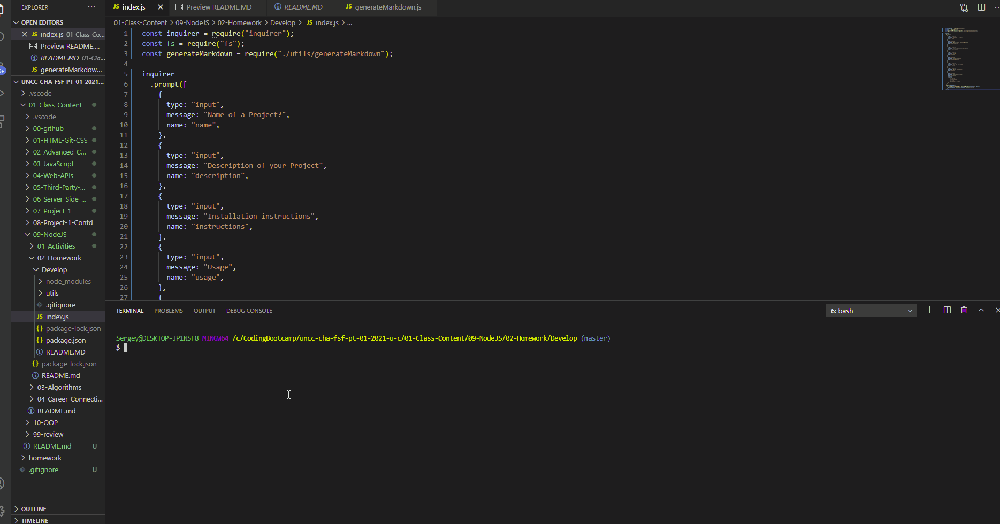

   <h1>Title Name: README.md Generator  </h1>
  
   ## Description :  
   
   You can quickly and easily create a README file by using a command-line application to generate one. This allows the project creator to devote more time to working on the project.

   <h3>## Content :

- [Description](#description)
- [Instruction](#instructions)
- [Usage](#usage)
- [Contributers](#contributers)
- [GitHub](#GitHub)
- [Email](#mail)
</h3>

## Instruction :

npm init npm inquirer

task is to create a command-line application that dynamically generates a professional README.md file from a user's input using the [Inquirer package](https://www.npmjs.com/package/inquirer).

## Usage :

The application will be invoked by using the following command:

```bash
node index.js
```
## GitHub Repo : (https://github.com/Sergey-ddbug/README-generator)

## Contributers : Sergey Ishimov

## GitHub Link : (https://github.com/Sergey-ddbug)

## Quick Video :

## Email : sishimov@gmail.com



# README-generator
